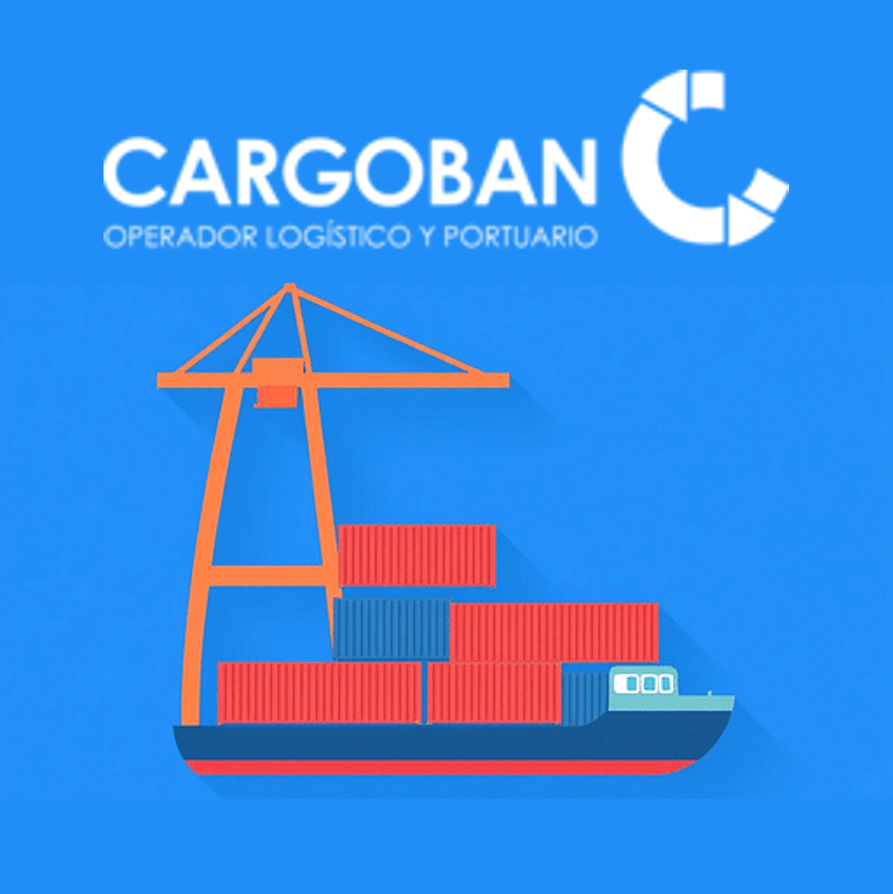
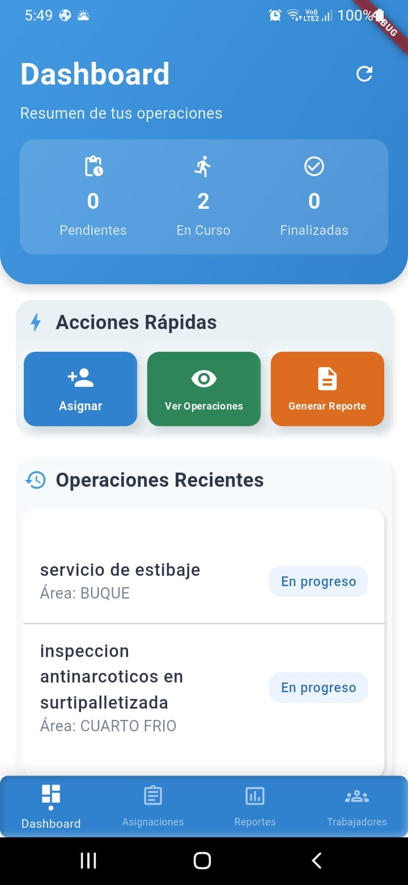
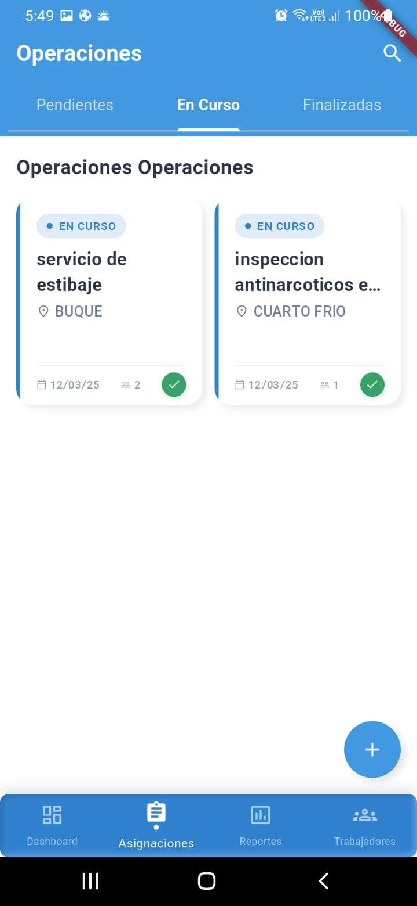
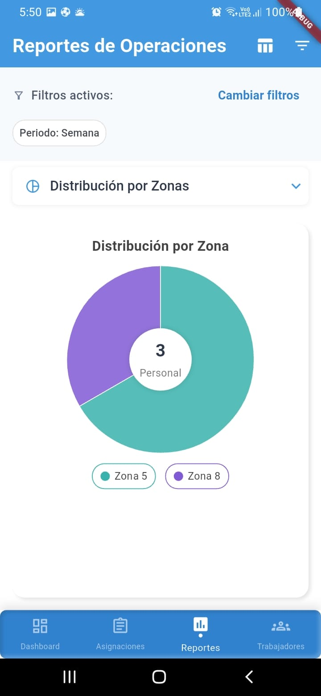
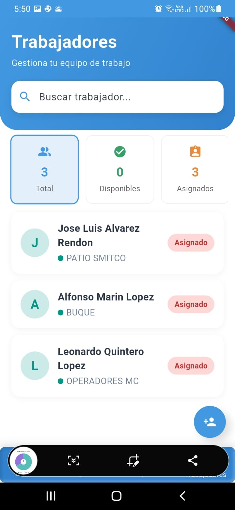

# PlannerOP - Sistema de Gestión de Operaciones Portuarias

<p align="center">
  
</p>

## 📱 Descripción

PlannerOP es una aplicación móvil desarrollada en Flutter para optimizar la gestión de operaciones portuarias. Permite a los supervisores asignar tareas, monitorear trabajadores, gestionar zonas y motonaves, y generar reportes detallados sobre las operaciones diarias.

## ✨ Características Principales

- **Gestión de Asignaciones**: Creación y seguimiento de tareas operativas
- **Administración de Personal**: Control de trabajadores y horas laboradas
- **Reportes Avanzados**: Generación de informes con filtros por zona, motonave y estado
- **Exportación de Datos**: Informes en formato Excel fácilmente compartibles
- **Visualización Gráfica**: Dashboard con estadísticas y gráficos de rendimiento
- **Sistema de Notificaciones**: Alertas sobre tareas pendientes y completadas
- **Gestión de Motonaves**: Seguimiento específico para operaciones en buques

## 🖼️ Capturas de Pantalla

<p align="center">
  
  
  
  
</p>

## 🛠️ Tecnologías

- **Flutter**: Framework de desarrollo multiplataforma
- **Provider**: Gestión de estados
- **Flutter Neumorphic**: Componentes de interfaz con diseño neumórfico
- **Excel**: Generación de reportes tabulares
- **Intl**: Internacionalización y formateo de fechas
- **Charts Flutter**: Visualización de datos estadísticos
- **Share Plus**: Funcionalidad para compartir archivos

## 🚀 Instalación

### 1. Clonar el repositorio

```bash
git clone https://github.com/DuvanBonilla/CargoPlannerApp.git
cd plannerop
```

### 2. Instalar dependencias

```bash
flutter pub get
```

### 3. Ejecutar la aplicación

```bash
flutter run
```

## 📋 Requisitos del Sistema

- Flutter SDK 3.0.0 o superior
- Dart 2.17.0 o superior
- Android SDK 21+ o iOS 11+
- 4GB de RAM mínimo recomendado para desarrollo

## 🧑‍💻 Uso de la Aplicación

### Creación de Asignaciones

1. Navega a la pestaña "Asignaciones"
2. Presiona el botón "+" para crear una nueva asignación
3. Completa los campos requeridos (área, zona, motonave, etc.)
4. Asigna trabajadores desde el listado disponible
5. Guarda la asignación

### Generación de Reportes

1. Accede a la sección "Reportes"
2. Configura los filtros deseados (periodo, área, zona, motonave, estado)
3. Visualiza los datos en formato gráfico o tabular
4. Exporta los resultados a Excel cuando sea necesario

## 📁 Estructura del Proyecto

```
lib/
├── core/
│   ├── model/           # Modelos de datos (Area, Assignment, Worker, etc.)
│   └── services/        # Servicios de la aplicación
├── screens/             # Pantallas principales
├── store/               # Providers para gestión de estado
│   ├── areas.dart
│   ├── assignments.dart
│   ├── clients.dart
│   ├── task.dart
│   └── workers.dart
├── utils/              # Utilidades y helpers
│   └── toast.dart      # Mensajes tipo toast
└── widgets/            # Widgets reutilizables
    └── assignments/    # Widgets específicos para asignaciones
        ├── assignment_form.dart
        ├── date_time_fields.dart
        ├── dropdown_field.dart
        ├── editAssignmentForm.dart
        └── workerSelection.dart
```

## 🤝 Contribución

1. Haz un fork del proyecto
2. Crea una rama para tu funcionalidad (`git checkout -b feature/amazing-feature`)
3. Haz commit de tus cambios (`git commit -m 'Add some amazing feature'`)
4. Envía a la rama (`git push origin feature/amazing-feature`)
5. Abre un Pull Request

## 📜 Licencia

Este proyecto está licenciado bajo la Licencia MIT. Ver el archivo `LICENSE` para más detalles.

## 👥 Equipo de Desarrollo

- **Lead Developer**: [KeniBeck](https://github.com/KeniBeck)
- **Developer**: [GhostRiderDev](https://github.com/GhostRiderDev)
- **UI/UX Designer**: [Nombre]
- **QA Engineer**: [Nombre]

## ⚙️ Configuración Avanzada

### Variables de Entorno

El proyecto utiliza diferentes variables de entorno para los ambientes de desarrollo, pruebas y producción. Para configurar estas variables:

1. Crea un archivo `.env` en la raíz del proyecto
2. Define las variables según el formato del archivo `.env.example`

### Internacionalización

La aplicación está preparada para soporte multiidioma. Para añadir un nuevo idioma:

1. Duplica los archivos de la carpeta `assets/i18n/es.json`
2. Renombra la copia según el código del idioma (ej. `fr.json`)
3. Traduce los valores manteniendo las claves

---

Desarrollado con ❤️ por Cargoban - [KeniBeck](https://github.com/KeniBeck) & [GhostRiderDev](https://github.com/GhostRiderDev)

Última actualización: Abril 2023